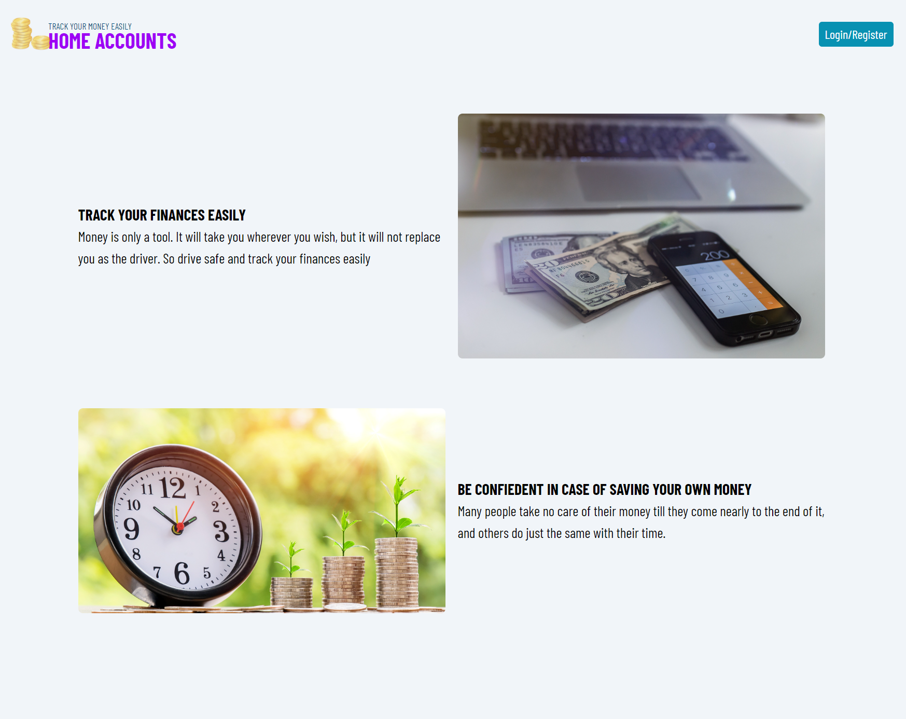
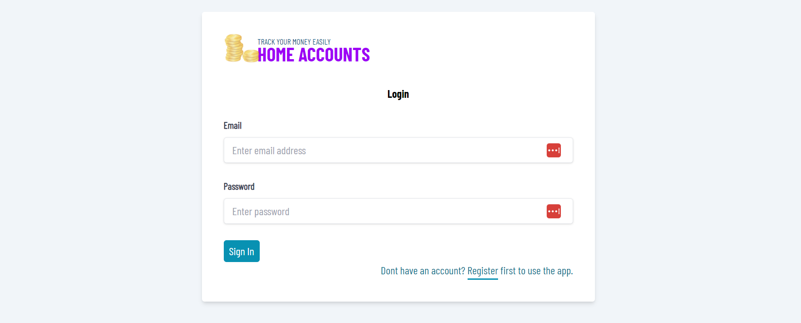
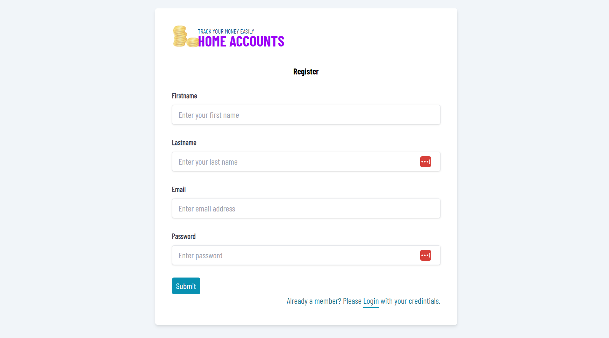
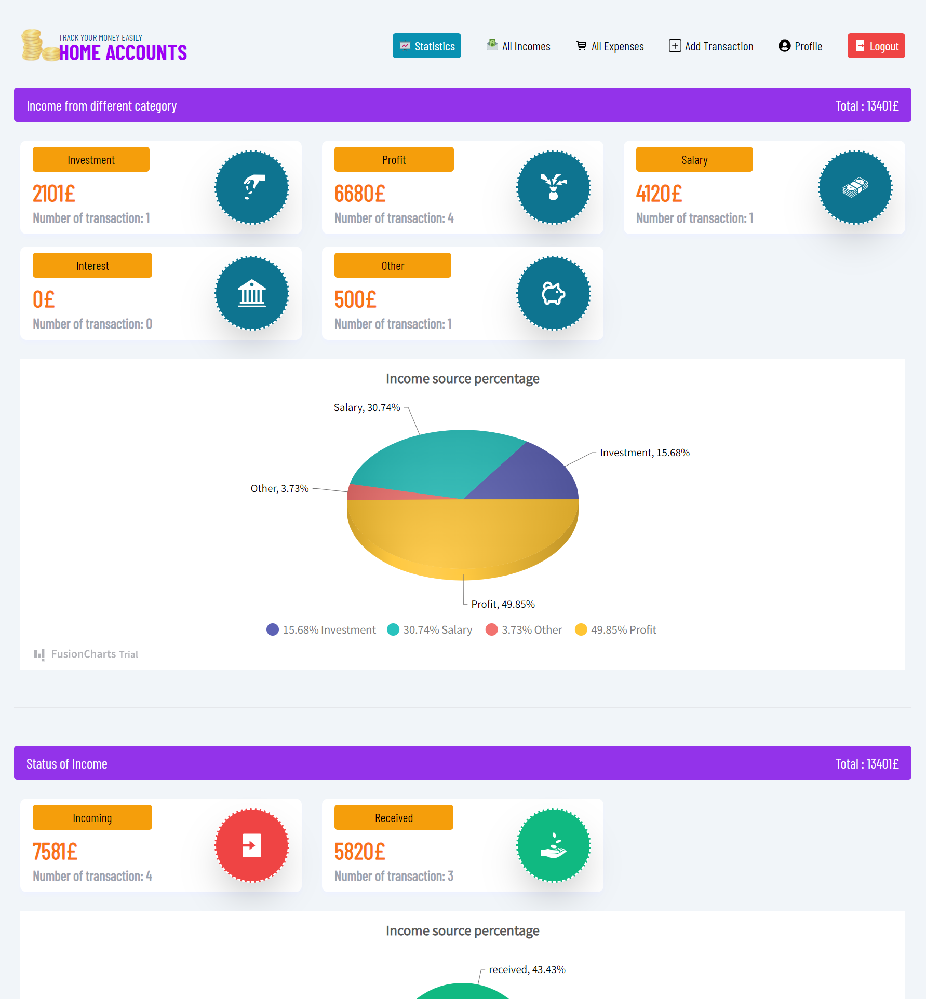
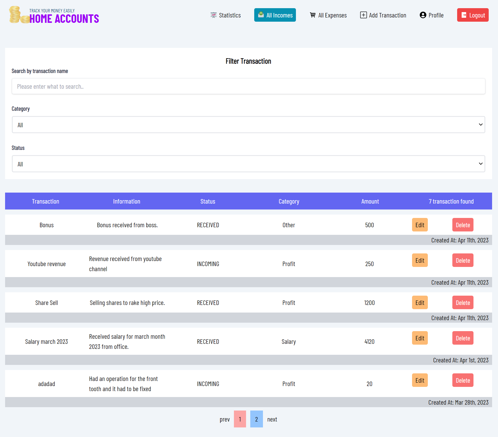
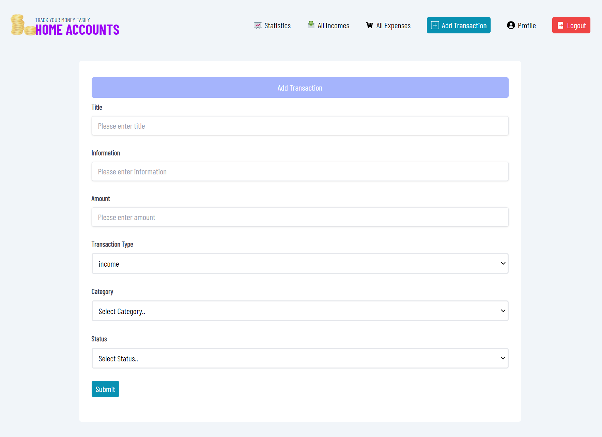
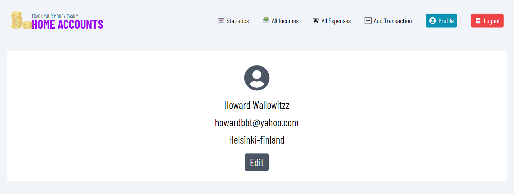

# home-accounts
This is a web app that allows users to track their financial activities. Any user can create and account and start tracking their money. This is very user friendly and easy to use. There is only one form with multiple option to enter any transaction. The app makes graphical analysis of all user transactions and it is easier for users to see the status of their finances in statistic page. The aim of this app is to give users a simple interface that is easy to use.   

## Api Documentation
[home-accounts-api](https://documenter.getpostman.com/view/14864737/2s93XyTi3i)

## Project Display








## Live Demo

[Course_Tracker](https://course-tracker-front.netlify.app/login)

## Built With

- Express
- MongoDB
- Mongoose
- Node JS 
- React
- React Icons
- Fushion Charts
- Tailwind 

# Getting Started

To get a local copy of the repository please run the following commands on your terminal:

```
$ cd <folder>
```

```bash

$ git clone `https://github.com/ajkacca457/course-tracker_finalcapstone.git`
$ cd react_capstone_tvshowcatalouge
$ Run `npm install` to install the necessary modules
$ Run `npm run start` to open app in localhost.

```

# Testing Project

To run test in your terminal:

```bash
$ Run `npm run test` to run test
$ enter `a` to run all the test in the app.

```
# Authors

👤 **Avijit Karmaker**

- Github: [@Avijit](https://github.com/ajkacca457)
- Linkedin: [@Avijit](https://www.linkedin.com/in/avijit-karmaker-8738a54)

## 🤝 Contributing

Contributions, issues and feature requests are welcome!

## Show your support

Give a ⭐️ if you like this project!

## Copyright
This is a project developed by Avijit.
